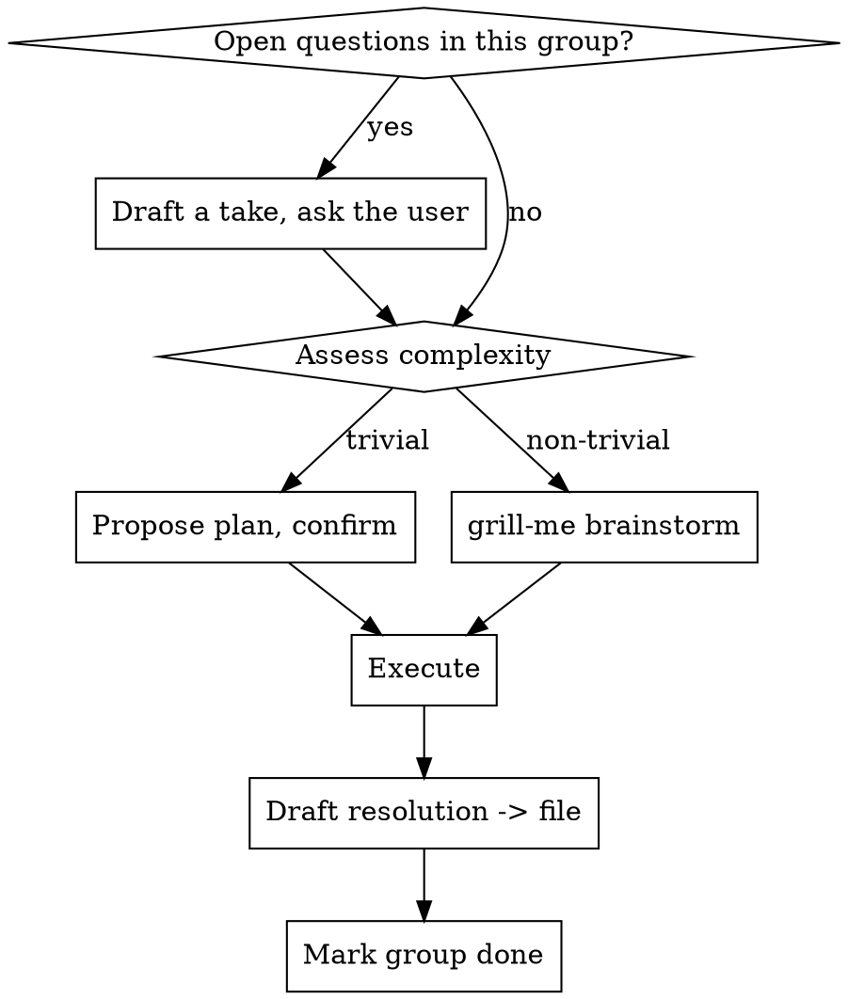

# Task Brainstorm

## Overview

Take a set of related tasks from context, bring them all into view at once, then work each group with the human in the loop. Tasks live in a state file you keep updated; each group is brainstormed (when non-trivial), executed, and finished with a drafted resolution left in the file for the user to send later.

Core principle: **bring everything into context first, then go group-by-group with the human steering.** Never flat-process a list in isolation - related tasks affect each other, and some "tasks" are open questions, not work.

## When to Use

- A batch of PR review comments to address
- A list of issues / Linear tickets / a pasted unstructured task dump
- Any set of tasks where some may be related, conflicting, or need a judgment call

Tasks come from **conversation context** - the user says "look at the PR comments, let's `/task-brainstorm`" or pastes a list. No formal ingestion; read what's in front of you.

**Not for:** a single task (just do it), or a list you've been told to execute without discussion.

## Checklist

Create a TodoWrite/TaskCreate item for each and do them in order:

1. **Collect tasks** from context - capture each verbatim
2. **Triage** - read referenced code to group intelligently (don't ask what you can find), propose an order, write the state file
3. **Confirm** groups + order with the user (let them pick what to focus on first)
4. **Work each group** (loop below)
5. **Wrap up** - confirm all groups done, all resolutions drafted in the file

## State File

Write to `TASKS_<SHORT_DESCRIPTION>.md` at the working-dir root. **This is the source of truth** - after compression or a long gap, re-read it to recover where you are. Update it at every state change *before* moving on.

```markdown
# Tasks: <short description>

## Groups

- [ ] **G1: <group name>** — status: triage
  - kind: work | question        # "question" = needs a take/decision, not a code change
  - tasks:
    - T1: <verbatim task text>
    - T3: <verbatim task text>
  - plan: <filled after brainstorm/assessment>
  - take: <for kind:question only - your recommended answer + reasoning, surfaced for the user's call, NOT acted on>
  - resolution: <drafted reply/summary - filled at end, NOT sent>

- [ ] **G2: ...**
```

`status` walks: `triage → planned → executing → drafting → done`. Tick the `- [ ]` when the group hits `done`.

## Work Loop (per group)



- **Open questions** (e.g. "should this be an error?", "leave to pyright?"): these are not work to silently action. Write your recommendation into the group's `take` field and surface it for the user's call before doing anything. This mirrors grill-me's "provide your recommended answer for each question."
- **Non-trivial group:** `**REQUIRED SUB-SKILL:** grill-me` to brainstorm the approach with the user before executing.
- **Trivial group** (typo, one-line nit): just propose the change and confirm - no full brainstorm.
- **Resolution:** after executing, draft a reply/summary into the file's `resolution` field. Drafting can also be a grill-me-style back-and-forth, or the user dictates it. Keep it - **do not send/post it.** Sending is a separate, explicit ask.

Soft default: pause at each group boundary so the user stays in the loop. If the user signals they trust you to batch the trivial ones, you may run those without stopping - but never batch a group with open questions.

## Red Flags - stop

- About to process the list flat, in order, without grouping → do triage first
- Tracking state only in your head / "I'll write the file at the end" → write/update the file *now*, before moving on
- Implementing an open question instead of asking → draft a take, surface it
- Running all groups without a single check-in → soft default is pause per group
- Sending/posting a drafted resolution → drafts stay in the file unless the user explicitly asks to send

## Common Mistakes

| Mistake | Fix |
|---|---|
| Flat-processing - misses that two comments are the same fix | Group in triage |
| No state file - loses place after compression | File is source of truth; update per change |
| Auto-sending replies | Leave in file; sending is a separate ask |
| Grilling every trivial typo | Brainstorm only non-trivial groups |
| Silently actioning "should we…?" comments | Those are questions - draft a take, ask |
