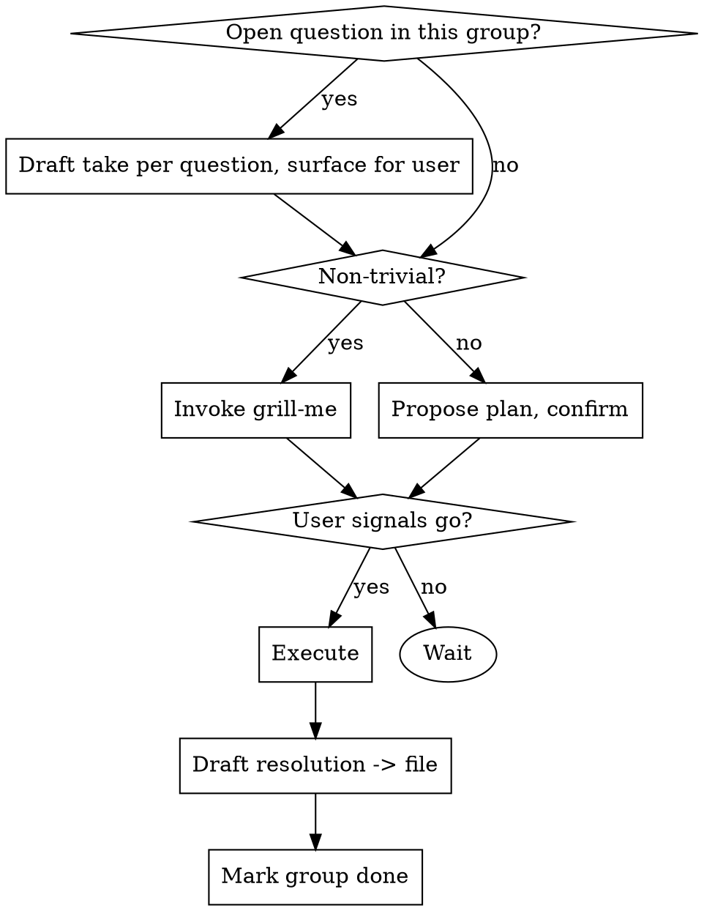

# Task Brainstorm

## Overview

Take a set of related tasks from context, bring them all into view at once, then work each group with the human in the loop. Tasks live in a state file you keep updated; each group is brainstormed (when non-trivial), executed, and finished with a drafted resolution left in the file for the user to send later.

Core principle: **bring everything into context first, then go group-by-group with the human steering.** Never flat-process a list in isolation — related tasks affect each other, and some "tasks" are open questions, not work.

## When to Use

- A batch of PR review comments to address
- A list of issues / Linear tickets / a pasted unstructured task dump
- Any set of tasks where some may be related, conflicting, or need a judgment call

Tasks come from **conversation context** — the user says "look at the PR comments, let's `/task-brainstorm`" or pastes a list. No formal ingestion; read what's in front of you.

**Not for:** a single task (just do it), or a list you've been told to execute without discussion.

## Checklist

1. **Collect tasks** from context — capture each verbatim
2. **Triage** — read referenced sources to get context for and understand each task in detail (don't ask what you can find), group tasks intelligently, propose an order, write the state file
3. **Confirm** — present groups + proposed order, ask *"Does this grouping and order look right before we start?"* Do not ask what to start on until the user confirms.
4. **Work each group** (loop below)
5. **Wrap up** — confirm all groups done, all resolutions drafted in the file

## State File

Write to `TASKS_<SHORT_DESCRIPTION>.md` at the working-dir root, starting with `> Created via /task-brainstorm.` **This is the source of truth** — after compression or a long gap, re-read it to recover where you are. Update it at every state change *before* moving on.

**One file per task set.** Update in place. Create a new file only when the previous set is fully complete. If a design decision reverses, update `**Take**` and `**Plan**` with the current decision and mark the discarded path inline: *"considered: [option] — rejected: [reason]"*.

### Format

Groups use `###` headers. Fields appear **progressively** — only add a field when its status is reached. Checkboxes track state at both group and task level.

**States:** `[ ]` not started · `[-]` brainstorming · `[x]` planned · `[✓]` resolved

**Task entry format** — verbatim quote + freeform source ref:

```markdown
- `[ ]` **T1** `source` — author
  > Verbatim text from the original comment / ticket / thread.
```

`source` is a freeform label: `file:line`, `LIN-123`, `slack #channel`, `conversation`, etc.

**Full lifecycle example** (bug triage — one group through all 4 states):

Stage 1 — triage, tasks only:

```markdown
### G1: Login & session bugs `[ ]`

**Tasks**
- `[ ]` **T1** `GH-142` — sarah
  > Logout doesn't clear the session cookie on iOS Safari. Rare but reproducible.
  > Worth fixing now or track for next quarter?
- `[ ]` **T2** `GH-156` — marcus
  > NullPointerException in UserService.authenticate() when email field is null.
```

Stage 2 — brainstorming, add **Take**:

```markdown
### G1: Login & session bugs `[-]`

**Tasks**
- `[-]` **T1** `GH-142` — sarah
  > Logout doesn't clear the session cookie on iOS Safari...
- `[x]` **T2** `GH-156` — marcus
  > NullPointerException in UserService.authenticate() when email is null.

**Take**
- T1: Open question — fix now vs defer. Recommend fix now: auth bugs compound. Awaiting user call.
- T2: Clear fix — add null guard before lookup. No design question.
```

Stage 3 — plan locked, add **Plan**:

```markdown
### G1: Login & session bugs `[x]`

**Tasks**
- `[x]` **T1** `GH-142` — sarah
  > ...
- `[x]` **T2** `GH-156` — marcus
  > ...

**Take**
- T1: Fix now. Clear session storage + cookie on logout regardless of platform.
- T2: Null guard before lookup.

**Plan**
T1: `AuthService.logout()` — call `session.invalidateAll()` before redirect.
T2: `UserService.authenticate()` — return `401` early if `email == null`.
```

Stage 4 — resolved, add **Resolution**:

```markdown
### G1: Login & session bugs `[✓]`

**Tasks** / **Take** / **Plan** (unchanged above)

**Resolution**
> Fixed session cookie clear on logout (all platforms). Added null guard in authenticate().
> Tests: `AuthServiceTest`, `UserServiceTest` all pass.
```

## Work Loop (per group)



- **Open questions** ("should this be an error?", "leave to pyright?"): write your recommendation into each task's **Take** entry and surface for the user's call. Do not action them silently.
- **Non-trivial group:** a group is non-trivial if it has **any open question**. Invoke `grill-me` at the **start** of the group — do not wait for the user to type it.
- **Trivial group** (typo, one-line nit): propose the change and confirm — no full brainstorm.
- **Execute gate:** never enter Execute without an explicit user signal ("go", "do it", "implement"). Completing a brainstorm does NOT trigger execution. Default: pause and ask *"Ready to execute?"* If the user pre-authorises batching trivial groups earlier in the session, that permission carries forward.
- **Map options before recommending:** when a group has competing design options, list all plausible choices before asking the user to pick. Recommending one option before the full space is mapped causes design pivots later.
- **Resolution:** after executing, draft a reply/summary into the group's `**Resolution**` field. **Do not send/post it.** Sending is a separate, explicit ask.

Soft default: pause at each group boundary. If the user signals they trust you to batch trivial ones, you may run those without stopping — but never batch a group with open questions.

## Red Flags — stop

- About to process the list flat, in order, without grouping → do triage first
- Tracking state only in your head / "I'll write the file at the end" → write/update the file *now*
- Implementing an open question instead of asking → draft a take, surface it
- Running all groups without a single check-in → soft default is pause per group
- Sending/posting a drafted resolution → drafts stay in the file unless explicitly asked to send
- Drafting a reply inline in chat instead of in the file's `**Resolution**` field → put it in the file
- Transitioning from brainstorm to implementation without an explicit user signal → ask *"Ready to execute?"*
- Creating a second state file while the first still has open groups → update in place

## Common Mistakes

| Mistake | Fix |
|---|---|
| Flat-processing — misses that two comments are the same fix | Group in triage |
| No state file — loses place after compression | File is source of truth; update per change |
| Auto-sending replies | Leave in file; sending is a separate ask |
| Grilling every trivial typo | Brainstorm only non-trivial groups (those with open questions) |
| Silently actioning "should we…?" comments | Those are questions — draft a take, ask |
| Presenting one option before the user has seen alternatives | Map all options first, even if one is clearly best |
| Skipping explicit group confirmation after triage | Ask "Does this grouping and order look right?" before starting |
